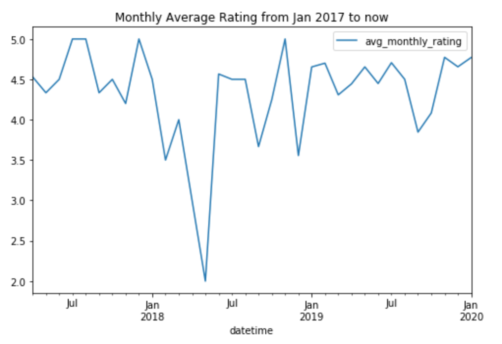

## Hello!

This is the offical documentation for the FreeAgent Data Mining & product Sentiment Project.

In a sentence, this project aims to establish how the FreeAgent brand is viewed by its users, how the service itself is viewed, as well as how favourable opinion of the public is towards the product.

This project aims to serve as a project where multiple data science skills are displayed:
<ul>
	<li> Python Scripting </li>
	<li> Data Mining </li>
	<li> Data Wrangling </li>
	<li> EDA </li>
	<li> Data Visualisation </li>
	<li> EDA with Non-negative Matrix Factorisation (ML)</li>
	<li> Sentiment Analysis (ML) </li>
</ul>

## File Structure

	analytics/ 	: scripts and notebooks for EDA and prediction
	
	data/ 	    : raw, scraped review data in a series of CSV:s
	
	scrapers/  	: scripts used to aquire the data
	
	static/  	: some images to prettify README.md

## Example of what you'll find:

We'll look at the possible trends of reviews mined online. What happened in early 2018?

## Disclaimer

This is very much a work in progress, and as I am (and should be moreso) writing my dissertation, I cannot rush to finish all the parts. That said, regardless of stage of completion, it should still serve as an indicator of skill.

Feel free to check out my trello board for the current progress!
<a href=https://trello.com/b/6p3eXTX2/freeagent-data-mining-project>https://trello.com/b/6p3eXTX2/freeagent-data-mining-project </a>

Hope you like it :)

Best regards,

Erik
